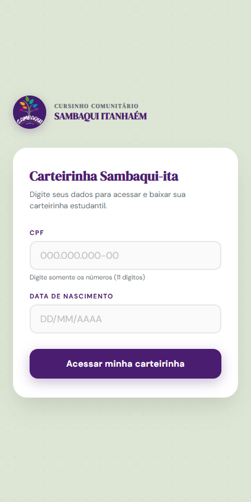
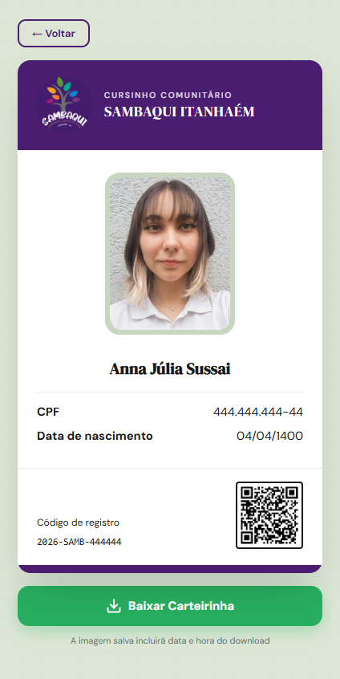
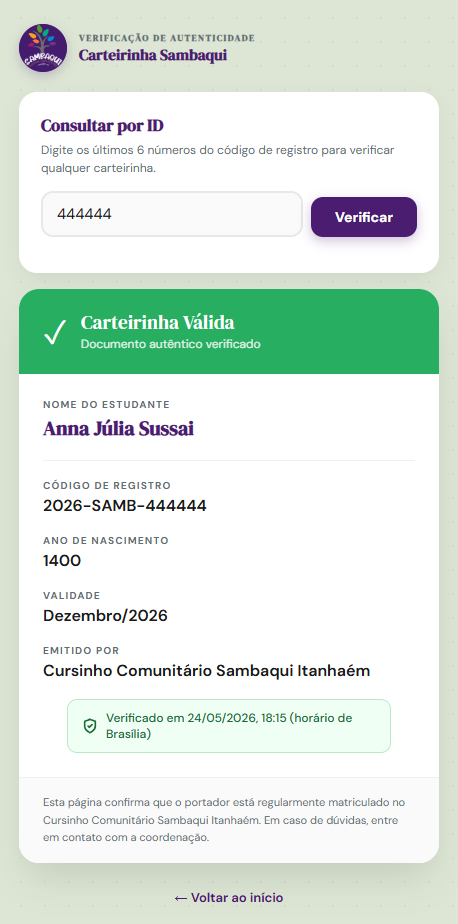

# Carteirinha Digital - Cursinho Comunitário Sambaqui Itanhaém

Sistema full-stack para o **Cursinho Comunitário Sambaqui Itanhaém**, permitindo que alunos consultem, gerem e baixem sua identificação estudantil digital de forma segura e rápida.

## Links do Projeto

- **Producao:** [https://sambaqui-carteirinha.onrender.com](https://sambaqui-carteirinha.onrender.com)
- **Verificacao de Carteirinha:** [https://sambaqui-carteirinha.onrender.com/validar/444444](https://sambaqui-carteirinha.onrender.com/validar/444444)

> ⚠️ **Aviso:** A aplicação está no plano gratuito do Render. Na **primeira acesso do dia**, pode levar **30 a 50 segundos** para carregar. **Aguarde uns instantes** e a página carregará normalmente.

## Telas do Sistema

### Tela de Login (Inicio)

*Aluno informa CPF e Data de Nascimento para acessar sua carteirinha.*

### Carteirinha Digital

*Carteirinha gerada com foto, dados do aluno, codigo de registro e QR Code para verificacao.*

### Verificacao de Autenticidade

*Pagina publica para validar a autenticidade da carteirinha atraves do codigo de registro.*

## Resumo do Projeto

App full-stack (Node.js/PostgreSQL) para emissao de carteirinhas digitais do Cursinho Comunitario Sambaqui Itanhaem.

**Funcionalidades:**

- Login seguro via CPF e Data de Nascimento
- Protecao contra ataques brute-force (Rate Limit)
- Geracao de imagem PNG com timestamp para download
- QR Code integrado para validacao em tempo real
- Seguranca avancada com Helmet, CORS e protecao contra SQL Injection

## Funcionalidades Principais

- **Autenticacao Dupla:** Acesso via CPF + Data de Nascimento (formato DD/MM/AAAA)
- **Geracao de Carteirinha:** Interface visual que converte dados em cartao digital estilizado
- **Download em PNG:** Exportacao da carteirinha com carimbo timestamp para evitar fraudes
- **Validacao por QR Code:** Sistema integrado onde o QR Code aponta para pagina de verificacao `/validar/:id`
- **Verificacao Publica:** Qualquer pessoa pode escanear o QR Code e validar a autenticidade da carteirinha
- **Seguranca:** 
  - Protecao contra SQL Injection (query parametrizada)
  - Headers de seguranca (Helmet)
  - Rate limiting (maximo 10 tentativas por IP em 15 minutos)
  - CORS configurado

## Tecnologias Utilizadas

### Backend
- **Node.js** - Runtime JavaScript
- **Express** - Framework web
- **PostgreSQL** - Banco de dados relacional (hospedado no Supabase)
- **pg** - Driver PostgreSQL para Node.js

### Seguranca
- **Helmet** - Headers de seguranca HTTP
- **Express-Rate-Limit** - Limitacao de requisicoes
- **CORS** - Compartilhamento de recursos entre origens

### Frontend
- **HTML5** - Estrutura das paginas
- **CSS3** - Estilizacao responsiva
- **JavaScript (Vanilla)** - Logica do cliente
- **html2canvas** - Geracao de imagem da carteirinha
- **QR Server API** - Geracao de QR Codes dinamicos

---
*Uso exclusivo para o Cursinho Comunitario Sambaqui Itanhaem. - Itanhaem, SP (2026).*
